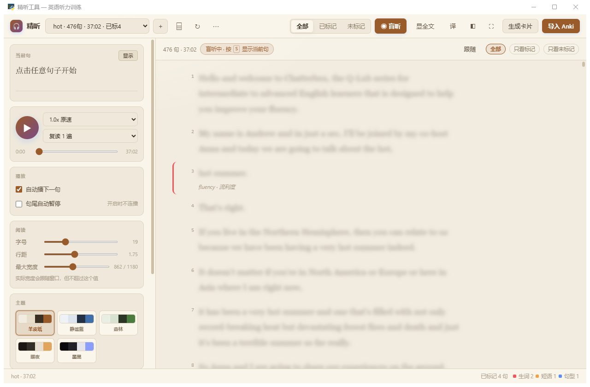

# goatListenPrac · 精听工具

> 播客 / 音频精听训练工具 — 本地转写、逐句精听、按类型制作 Anki 卡片

一个为**英语听力训练**设计的桌面工具。把音频转成逐句文字稿，边听边标记听不懂的地方，按标记类型自动生成 Anki 卡片。

**离线可用** · **零 API 费用** · **不用网页服务** · **数据全在本地**



---

## 下载

前往 [Releases](https://github.com/At1ve/goatListenPrac/releases) 下载：

| 文件 | 大小 | 说明 |
|---|---|---|
| `goatListenPrac-Setup-1.0.0.exe` | 73 MB | **Windows 安装包（推荐）** |
| `goatListenPrac-1.0.0-source.zip` | 226 KB | 源码（需自己装 Python）|

安装包**已内置 Python 运行时和全部依赖**，双击安装即可用，无需配置任何环境。

---

## 为什么做这个

现有的句子挖掘工具基本都是为**看剧**（视频+字幕）或**日语**场景设计的：

| 工具 | 交互标记 | 按类型分卡 | 自动查词 | 播客音频 | 免配置 |
|---|---|---|---|---|---|
| **本工具** | ✅ | ✅ 5 类 | ✅ | ✅ | ✅ |
| [audio2anki](https://github.com/hiAndrewQuinn/audio2anki) | ❌ 全自动 | ❌ | ❌ | ✅ | ✅ |
| [mpvacious](https://github.com/Ajatt-Tools/mpvacious) | ✅ | ❌ | ⚠️ | ❌ | ❌ |
| [asbplayer](https://github.com/MatiasIslaA/asbplayer) | ✅ | ❌ | ❌ | ✅ | ⚠️ |
| [subs2srs](https://github.com/erjiang/subs2srs) | ❌ 全自动 | ❌ | ❌ | ⚠️ | ⚠️ |

**核心差异**：全自动工具会把整篇材料变成几百张卡，复习量爆炸。本工具的设计原则是 **i+1** —— 只听不懂的地方才做卡，每 10 分钟音频做 5-15 张。

---

## 功能

### 转写
- **faster-whisper 本地转写**，无需联网、无 API 费用
- 自动按**句子边界**重新切分（Whisper 的默认分段会把句子切断）
- 速度约 **13 倍实时**（32 分钟音频 ≈ 2.5 分钟）

### 精听
- **点句子块播放，再点暂停**（正在播的句子左侧竖条会呼吸闪动）
- **句尾自动暂停** + 每句复读 1-5 遍
- **变速** 0.55x ~ 1.6x
- **跟随开关**（默认关）：需要时自动滚动到当前句，不需要时不打扰你浏览

### 盲听模式（默认开启）⭐
**文字默认是模糊的**，逼你用耳朵听而不是用眼睛读。

- 点句子左侧的 ▶ 只听不看，**再点一次 = 暂停**
- 点「显示」按钮或**双击句子**揭示当前句，`Ctrl+H` 显示全文
- 单击句子只播放，**不会误揭文字**
- 翻译同样被遮住，避免泄露意思
- 标记不需要看见文字，全文模式下再补内容

> 文字一直摆在眼前时，大脑会不自觉地去读 —— "好像听懂了"其实是读懂的，这是精听无效的根本原因。

### 标记（5 类）
| 按键 | 类型 | 用于 |
|---|---|---|
| `1` | 生词 | 不认识的词 |
| `2` | 短语 | 搭配反应不出来 |
| `3` | 句型 | 结构没听懂 |
| `4` | 连读 | 听不出词边界 |
| `5` | 整句 | 就是没懂 |

标记后可随时**编辑内容、修改、删除**（点徽章 / 按 `E` / 行内「改」按钮）。

### 材料管理
- **删除材料**：删除前列出将删内容，可选是否连原始音频一起删
- **重命名**：音频 + 转写 + 标记一起改名
- **重新转写**：换模型或音频更新后重跑

### 制卡
按标记类型生成**结构不同**的卡片，自动切好音频：

| 类型 | 卡片背面 |
|---|---|
| 生词 | 句子（词高亮）+ 音标 + **自动查的中文释义** + 例句 |
| 短语 | 句子（短语高亮）+ 释义 |
| 句型 | 句子 + 结构说明 |
| 连读 | 句子 + 误听内容 |
| 整句 | 句子 + 备注 |

通过 **AnkiConnect** 导入，**Anki 不用关**。

### 阅读体验
- **5 种主题**：羊皮纸（默认）/ 静谧蓝 / 森林 / 暖夜 / 墨黑
- **字号、行距、最大宽度可调**（衬线字体，长文阅读更省力）
- **行宽跟随窗口自适应**，左右留白也会收缩，不留大片空白
- **全屏模式**：`F11` 一键进入，自动收起侧栏，无标题栏铺满屏幕
- **侧栏宽度可拖拽**，设置自动保存
- **自动记住播放位置和上次打开的材料**（存 `ui_state.json`），下次打开接着听
- 划词即时查词
- 整句 / 整篇翻译（Google 免费接口 + 本地缓存）

### 其他
- 命令面板 `Ctrl+K`
- 全套键盘快捷键
- 设置自动保存

---

## 快速开始

### 方式一：安装包（推荐）

1. 从 [Releases](https://github.com/At1ve/goatListenPrac/releases) 下载
   `goatListenPrac-Setup-1.0.0.exe`
2. 双击安装，选择目录
3. 从开始菜单或桌面图标启动

**无需安装 Python。** 首次转写时会自动下载 Whisper 模型（约 500MB），之后就不再需要联网。

### 方式二：从源码运行

需要 **Windows 10/11** 和 **Python 3.9+**：

```bash
git clone https://github.com/At1ve/goatListenPrac.git
cd goatListenPrac

pip install -r requirements.txt
python setup.py            # 自动下载 ffmpeg
python src/app.py
```

或者双击 `安装.bat` 再双击 `启动.bat`。

### 可选：安装 Anki

只有在**导入卡片**时才需要 [Anki](https://apps.ankiweb.net/)。
装好 Anki 后还需要装 [AnkiConnect](https://ankiweb.net/shared/info/2055492159) 插件：

```
Anki → 工具 → 插件 → 获取插件 → 输入 2055492159 → 重启 Anki
```

> **为什么安装包不代装 Anki？**
> 试过自动下载 MSI 静默安装、并直接往 `addons21` 写插件文件，
> 但 Anki 26 的插件注册还依赖它自己的配置库（`prefs21.db`），
> 外部写入的插件目录不会被加载 —— 会让用户以为装好了却用不了。
> 用 Anki 自带的「获取插件」是官方推荐方式，最可靠。
>
> 安装包会检测你有没有装 Anki，装好了会弹窗提示怎么配插件；
> 详细步骤见安装目录下的 `docs\Anki安装指引.txt`。

### 内置的 ffmpeg

安装包**自带 ffmpeg**（约 100MB），生成卡片时切音频直接可用，**不需要联网**。

源码运行时请先执行 `python setup.py` 自动下载。

### 使用流程

1. 启动 Anki（可选，导入卡片时需要）
2. 点 **＋** 导入音频 → 自动转写
3. 逐句听，听不懂的按 `1`~`5` 标记
4. 点 **生成卡片** → 点 **导入 Anki**
5. 在 Anki 里复习

> **转写速度**：约 13 倍实时（32 分钟音频约 2.5 分钟）。
> 首次转写会下载模型，之后就不用等了。

---

## 快捷键

| 键 | 作用 |
|---|---|
| `空格` | 播放 / 暂停 |
| `R` | 重播当前句 |
| `↑` `↓` | 上 / 下一句 |
| `←` `→` | 快退 / 快进 3 秒 |
| `1`~`5` | 标记（生词/短语/句型/连读/整句）|
| `Del` | 取消标记 |
| `T` | 中文翻译开关 |
| `F` | 专注模式 |
| `C` | 复制当前句 |
| `Ctrl+K` | 命令面板 |
| `Ctrl+B` | 收起侧栏 |
| `Ctrl+O` | 导入材料 |

---

## 目录结构

### 仓库内容

```
goatListenPrac/
├── src/                        源码
│   ├── app.py                  程序入口 + 本地 HTTP 服务
│   ├── core.py                 核心逻辑（转写/切句/制卡/翻译/路径）
│   ├── resplit.py              按句子边界重新切分
│   ├── filedialog_win.py       原生文件对话框
│   ├── clear_deck.py           清空 Anki 牌组
│   └── check_js.py             前端语法检查
├── web/
│   └── index.html              界面（单文件，无依赖）
├── build/                      构建脚本
│   ├── build_release.py        自检 + 打包源码
│   ├── build_exe.py            打包成 exe（PyInstaller）
│   ├── build_installer.py      生成安装包（Inno Setup）
│   └── installer.iss           安装包脚本
├── README.md  使用说明.md  LICENSE
├── requirements.txt  setup.py
└── 启动.bat  安装.bat
```

### 运行时的数据放哪

**用户数据默认放在仓库外面**，这样仓库始终保持干净：

```
你的工作目录/
├── goatListenPrac/         ← git clone 下来的仓库
├── runtime/                ← 自动生成：mp3s / marks / transcript / cards
└── ffmpeg/                 ← setup.py 自动下载
```

如果 `runtime/` 不存在，程序会退回用仓库目录本身（不影响使用）。

想自定义位置就设环境变量 `JINGTING_RUNTIME`。

---

## 从源码构建

```bash
# 1. 打包成 exe（需要 pip install pyinstaller）
python build/build_exe.py

# 2. 生成安装包（需要 Inno Setup 6）
python build/build_installer.py

# 3. 只检查和打包源码
python build/build_release.py
```

产物都在 `dist/` 下，不会污染仓库。

---

## 环境变量

| 变量 | 说明 |
|---|---|
| `JINGTING_RUNTIME` | 用户数据目录，默认 `<仓库同级>/runtime` |
| `ANKI_COLLECTION` | Anki 数据库完整路径（自动探测失败时用）|
| `ANKI_BASE` | Anki 数据根目录 |
| `ANKI_CONNECT_URL` | AnkiConnect 地址，默认 `http://127.0.0.1:8765` |

---

## 常见问题

**Q: 导入 Anki 失败**
先启动 Anki，等它完全加载（约 30 秒）。需要安装 [AnkiConnect](https://ankiweb.net/shared/info/2055492159) 插件。

**Q: 点「＋ 导入材料」没反应**
改用 **⌸** 手动输入文件路径，或把 mp3 拖进窗口。

**Q: 转写太慢**
`src/core.py` 里 `_get_model()` 可换更小的模型（`base` 比 `small` 快约 2 倍）。

**Q: 应该标记多少句**
每 10 分钟音频 **5-15 句**。宁少勿多 —— 复习量会复利增长。

---

## 设计原则

1. **i+1 而非全量** —— 只把听不懂的地方做成卡
2. **正面只有音频** —— 逼大脑直接从声音提取意义
3. **键盘优先** —— 精听时手不离开键盘
4. **本地优先** —— 音频和笔记不出本机

---

## 技术栈

- [faster-whisper](https://github.com/SYSTRAN/faster-whisper) — 本地语音识别
- [pywebview](https://pywebview.flow.io/) — 桌面外壳（WebView2）
- [AnkiConnect](https://github.com/FooSoft/anki-connect) — 与 Anki 通信
- [FFmpeg](https://ffmpeg.org/) — 音频切分

---

## License

MIT
